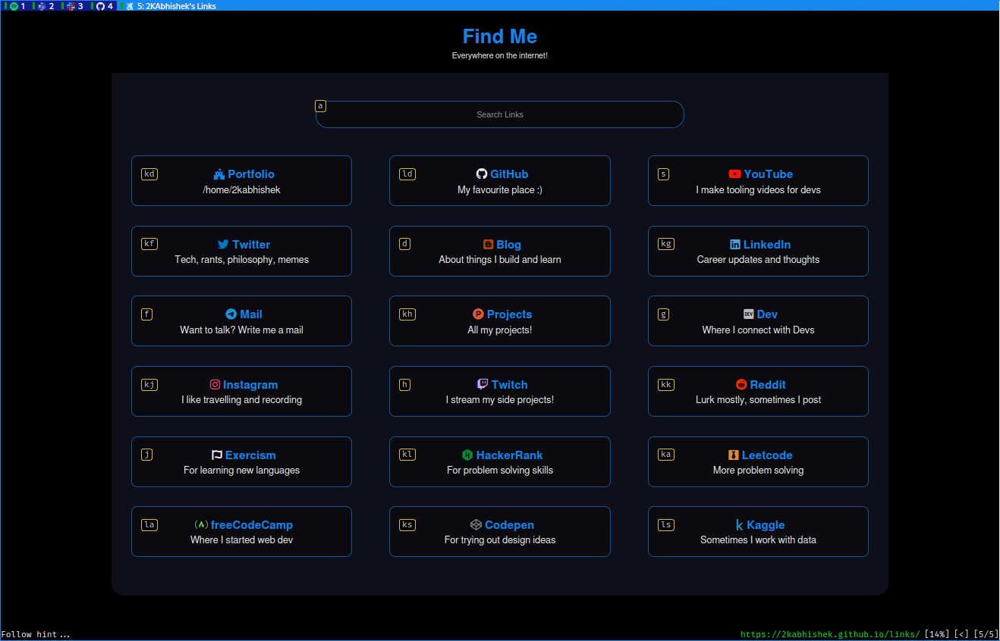

<div align = "center">

<h1><a href="https://github.com/2kabhishek/qute2k">qute2k</a></h1>

<a href="https://github.com/2KAbhishek/qute2k/blob/main/LICENSE">
 </a>

<a href="https://github.com/2KAbhishek/qute2k/graphs/contributors">
 </a>

<a href="https://github.com/2KAbhishek/qute2k/stargazers">
</a>

<a href="https://github.com/2KAbhishek/qute2k/network/members">
 </a>

<a href="https://github.com/2KAbhishek/qute2k/watchers">
 </a>

<a href="https://github.com/2KAbhishek/qute2k/pulse">
 </a>

<h3>The fastest and qutest browser 🌐🎀</h3>

<figure>
  
  <br/>
  <figcaption>qute2k in action</figcaption>
</figure>

</div>

qute2k is a [qutebrowser](https://qutebrowser.org/) config that aims to make the browser fully keyboard navigable.

## ✨ Features

- Sane and easily expandable configs
- Logical keybindings, inspired by vim ([nvim2k](https://github.com/2kabhishek/nvim2k))

## ⚡ Setup

### ⚙️ Requirements

- 'qutebrowser' 3.0+

### 💻 Installation

Installation is as simple as cloning and symlinking

```bash
# Clone Repo
git clone https://github.com/2kabhishek/qute2k
```

On Linux

```bash
ln -sfnv $PWD/qute2k $HOME/.config/qutebrowser
```

On Mac

```bash
ln -sfnv $PWD/qute2k $HOME/.qutebrowser
```

On Windows

```powershell
New-Item -ItemType SymbolicLink -Path "$env:APPDATA\qutebrowser\config" -Target "$PWD\qute2k" -Force
```

## 🚀 Usage

Launch qutebrowser after finishing installation steps.

Update variables section in [config.py](./config.py) according to your needs.

Use vim keybindings and ex (`:`) commands for various actions.

### ⌨️ Keybindings

All the configured keybindings can be found in the [keybinding manual here](./docs/keybindings.md).

## 🧑‍💻 Behind The Code

### 🌈 Inspiration

I have always wanted a mouse less workflow, but the browser was always a blocker, qute2k fixes it!!

### 💡 Challenges/Learnings

- The initial configuration process involved a lot of docs, but was worth it.

### 🧰 Tooling

- [dots2k](https://github.com/2kabhishek/dots2k) — Dev Environment
- [nvim2k](https://github.com/2kabhishek/nvim2k) — Personalized Editor
- [sway2k](https://github.com/2kabhishek/sway2k) — Desktop Environment

### More Info

- [nightblue](https://github.com/2KAbhishek/nightblue) — A dark theme for Firefox, with `userChrome` support.

<hr>

<div align="center">

<strong>⭐ hit the star button if you found this useful ⭐</strong><br>

<a href="https://github.com/2KAbhishek/qute2k">Source</a>
| <a href="https://2kabhishek.github.io/blog" target="_blank">Blog </a>
| <a href="https://twitter.com/2kabhishek" target="_blank">Twitter </a>
| <a href="https://linkedin.com/in/2kabhishek" target="_blank">LinkedIn </a>
| <a href="https://2kabhishek.github.io/links" target="_blank">More Links </a>
| <a href="https://2kabhishek.github.io/projects" target="_blank">Other Projects </a>

</div>
